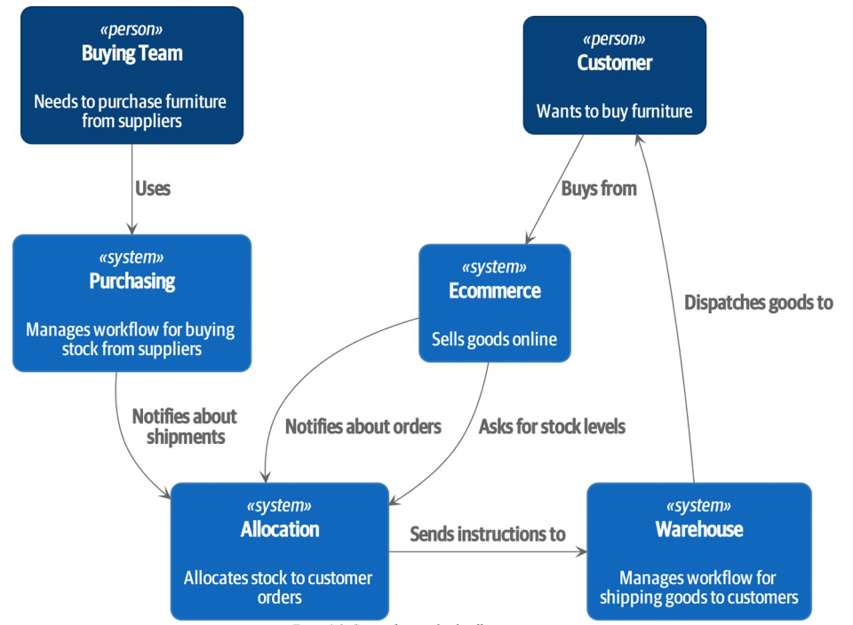
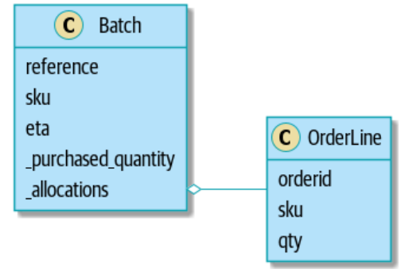
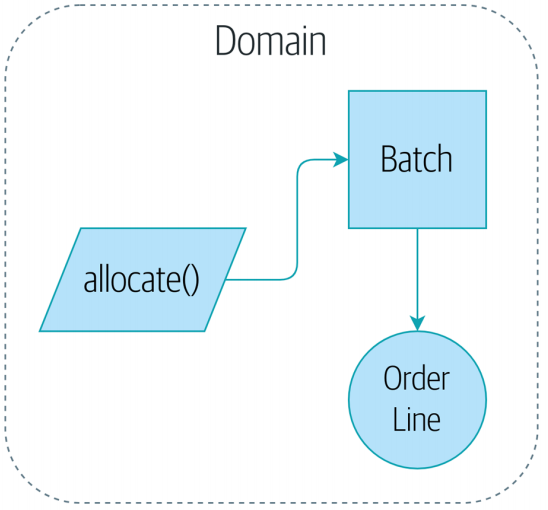
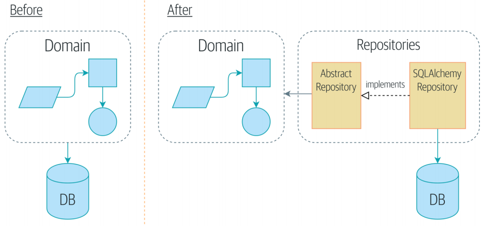
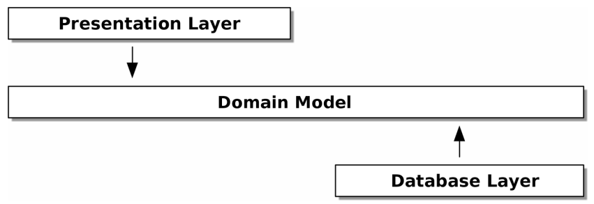
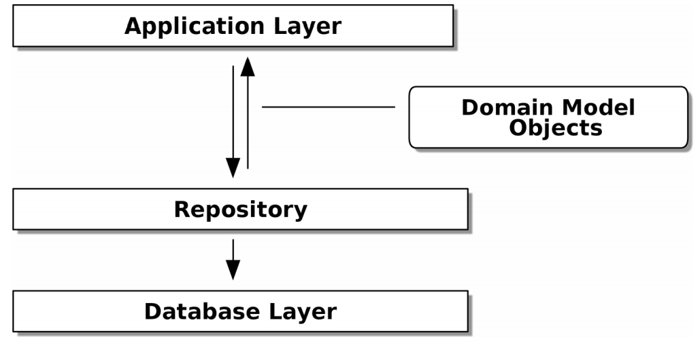
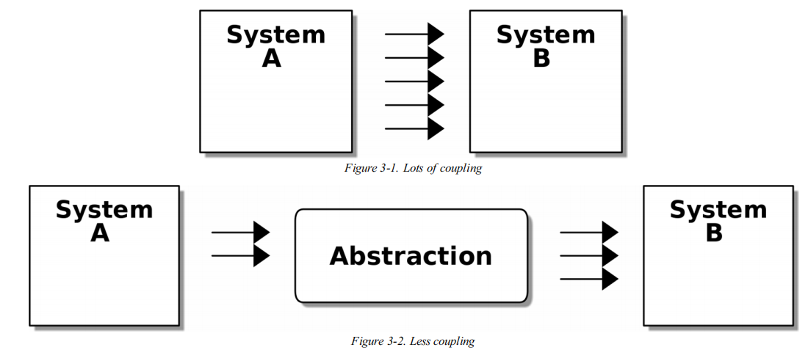
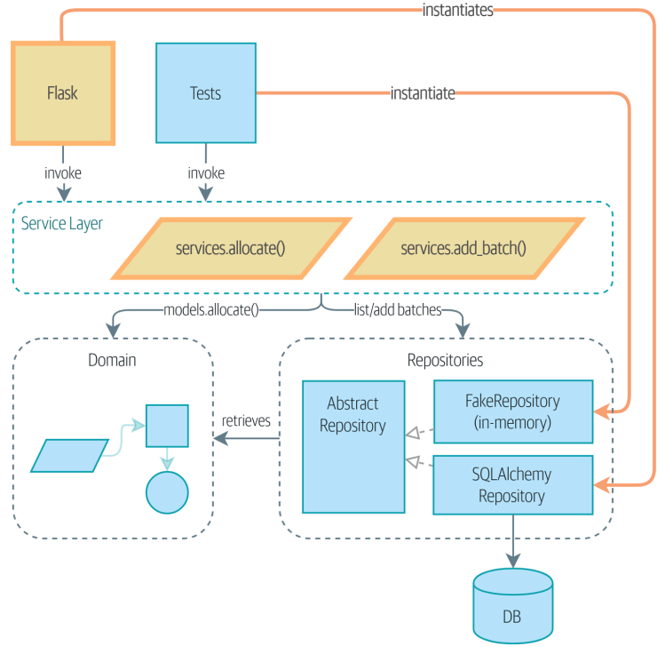
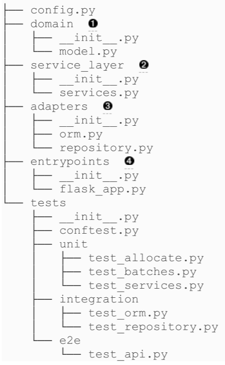
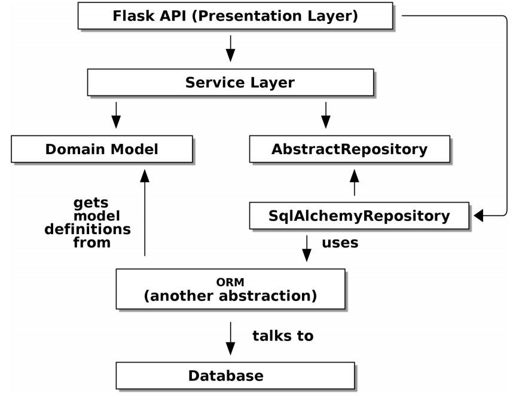

[toc]

## Preface

Reference

* *Test-Driven Development with Python* by Harry
* *Domain-Driven Design* by Eric
* *Implementing Domain-Driven Design* by Vaughn
* *Patterns of Enterprise Application Architecture* by Martin

Three tools for managing complexity:

* Test-driven development (TDD)
* Domain-driven design (DDD)
* Loosely coupled (micro) services integrated via messages (also called reactive microservices)

## Introduction

**Encapsulation and Abstraction（封装和抽象）**

* Simplifying behavior and hiding data
* Encapsulating behavior by identifying a task that needs to be done in our code and giving that task a well-defined object or function. We call that object of function an *abstraction*
* Encapsulating behavior by using abstractions is a powerful tool for making code more expressive, more testable, and easier to maintain.

**Layering（分层）**

When one function, module, or object uses another, we say that the one depends on the other. The interactions between our objects and functions may causes chaos, and the layered architectrues are one way of trackling this problem. The three-layered architecture(presentation layer, business logic, database layer) is one of the most common example.

* Presentation layer: user-interface components, like a web page, and API, or a command line
* Business logic: business rules and our workflows
* database layer: storing and retrieving data

Business logic becomes spread throughout the layers of our application is a common bad practice.

**依赖倒置原则（The Dependency Inversion Principle）**

A. High level modules should not depend upon low level modules. Both should depend upon abstractions.

B. Abstractions should not depend upon details. Details should depend upon abstraction.

A. 高层模块不应该依赖于低层模块，二者都应该依赖于抽象。

B. 抽象不应该依赖于具体实现细节，而具体实现细节应该依赖于抽象。

**Principles **(p12)

Behavior should come first and drive our storage requirements 

build model through TDD 

Keep model decoupled from technical concerns

build persistence-ignorant code

create stable APIs around our domain 

## Chapter 1. Domain Modeling

### Domain Modeling Concept

* Among the three-layered architecture (presentation layer, business logic, database layer), the **domain model** is close to business logic. The **domain model** is the mental map that business owners have of their business. (p14) 
* The book shows the basic of building a domain model, and building an architecture around it that *leaves the model as free as possible from external constraints*. (p15)
* Domain modeling is closest to the business. *Make it easy to understand and modify*. (22)

### The Allocation System

We have separate systems that are responsible for buying stock, selling stock to customers, and shipping goods to customers. The allocation system needs to coordinate the process by allocating stock to a custormers' orders. (p15) 



Now we build a simple domain model that can allocate orders to batches of stock. Below is the related **domain knowlege** for the allocation system.

* Customers place orders. An order is identified by an order reference and comprises multiple order lines, where each line has  SKU and a quantity.
* Purchasing department orders small batches of stock. A batch of stock has a unique ID called a reference, a SKU, and a quantity.
* When we allocate an order line to a batch, we will send stock from that specific batch to the customer's delivery address. When we allocate x units of stock to a batch, the available quantity is reduced by x.
* Batches have an ETA if they are currently shipping, or they may be in warehouse stock. We allocate to warehouse stock in preference to shipment batches. We allocate to shipment batches in order of which has the earliest ETA.

 A batch now keeps track of a set of allocated OrderLine objects. When we allocate, if we have enought available quantity, we just add to the set. (p19)

**Value Object**

* Whenever we have a business concept that has data but no identity, we often choose to represent it using *Value Object* pattern. A value object is any domain object that is uniquely identified by the data it holds; we usually make them immutable. (p19)
* An order line is uniquely identifies by its order ID, SKU, and quantity; if we change one of those values, we now have a new line. (p20)

```python
@dataclass(frozen = True)
class OrderLine:
    orderid: int
    sku: str
    qty: int
```

**Entities**

* Entities, unlike values, have identity equality. We can change their values, and they are sitll recognizable the same thing. （p20)
* A batch is identifies by a reference and thus is classified as entities. We can allocate lines to batch, or change the data that we expect it to arrive, and it will still be the same entity. （p20)
* The `__eq___` magic function to identify whether two batches are same as below.
* The ```__hash__``` magic function make Batch object *hashable* and can be used in set() or dict(). (You shouldn't modify ```__hash__``` without modifying ```__eq__```)

```python
class Batch:
    def __init__(self, ref: str, sku: str, qty: int, eta, Optional[Date]):
        self.reference = ref
        self.sku = sku
        self.eta = eta
        self._purchased_quantity = qty
        self._allocations = set()

    def __eq__(self, other):
        if not isinstance(other, Batch):
            return False
        return other.reference = self.reference
    
    def __hash__(self):
        return hash(self.reference)
```

**Domain Service**

* A function that allocates an order line, given a set of batches, is a domain service. Domain service operations don't have a natural home in an entity or value object. （p21)

```python
def allocate(line: OrderLine, batches: List[Batch]) -> str:
    try:
        batch = next(
            b for b in sorted(batches) if b.can_allocate(line)
        )
        batch.allocate(line)
        return batch.reference
    except StopIteration:
        raise OutOfStock(f'Out of stock for sku {line.sku}')
```

* Domain services are not the same thing as services from the *service layer*. A domain service represents a business concept or process, whereas a service-layer service represents a use case for your application. *Often the service layer will call a domain service*.（p23)

### Wrap Up





## Chapter 2. Repository Pattern

In this chapter we'll need a way to retrieve batch info from the database and instantiate our domain model objects from it, and we'll also need a way of saving them back to the database. (p25)

### Inverting the Dependency using classical mapping: ORM Depends on Model

*High level modules (model.py) should not depend upon low level modules (orm.py). Both should depend upon abstractions.*

​																															  --- 依赖倒置原则（The Dependency Inversion Principle）

*  ORM ensures the *persistence ignorance* (the domain model doesn't need to know anything about how data is loaded and persisted).(p26)

在目前的企业应用系统设计中，MVC，即 Model（模型）- View（视图）- Control（控制）为主要的系统架构模式。MVC 中的 Model 包含了复杂的业务逻辑和数据逻辑，以及数据存取机制（如 JDBC的连接、SQL生成和Statement创建、还有ResultSet结果集的读取等）等。*将这些复杂的业务逻辑和数据逻辑分离，以将系统的紧耦 合关系转化为松耦合关系（即解耦合），是降低系统耦合度迫切要做的，也是持久化要做的工作。*MVC 模式实现了架构上将表现层（即View）和数据处理层（即Model）分离的解耦合，而持久化的设计则实现了数据处理层内部的业务逻辑和数据逻辑分离的解耦合。 

* **SQLAlchemy classical mapping**: Define the schema separately, and to define an explicit mapper for how to convert between the schema and our domain model. 
* The ORM (the data persistence that describes how data is loaded and persisted) imports the domain model, and not the other way around.

```python
#model.py
@dataclass(unsafe_hash=True)
class OrderLine:
    orderid: str
    sku: str
    qty: int
```

```python
#orm.py
from sqlalchemy.orm import mapper, relationship
import model

metadata = MetaData()
order_lines = Table(
	'order_lines', metadata,
    Column('id', Integer, primary_key=True, autoincrement=True),
    Column('sku', String(255)),
    Column('qty', Integer, nullable=False),
    Column('orderid', String(255)),)

def start_mappers():
    lines_mapper = mapper(model.Orderline, order_lines)
```

* If we call the mapper function, we will be able to easily load and save domain model instances from and to the database. But if we never call that function, our domain model classes stay blissfully unaware of the database.
* The *start_mappers()* function is binded in the session, which is used every time ORM talks to database.

```python
from sqlalchemy import create_engine
from sqlalchemy.orm import sessionmaker, clear_mappers
from orm import metadata, start_mappers

def in_memory_db():
    engine = create_engine('sqlite:///:memory:')
    metadata.create_all(engine)
    return engine

def session(in_memory_db):
    start_mappers()
    yield sessionmaker(bind=in_memory_db)()
    clear_mappers()
```

Using SQLAlchemy directly in our API endpoint:

```python
@flask.route.gubbins
def allocate_endpoint():
	session = start_session()
	line = OrderLine(request.json['orderid'], request.json['sku'], request.json['qty'])
    # load all batches from the DB
    batches = session.query(Batch).all()
    # call our domain service
    allocate(line, batches)
	# save the allocation back to the database
    session.commit()
    return 201
```

### The Repository Pattern

* The repository pattern is an abstraction over persistent storage. It hides the boring details of data access by predending that all of our data is in memory.
* We swape the *SQLAlchemy abstraction(session.query(Batch))* for a *repository one (batches_repo.get)*
* The repository pattern is a simplifying abstraction over the data storage, allowing us to decouple our model layer from the data layer. We'll build a *Repository* object that sits between our domain mode and the database. (p24)
* The repository pattern is an abstraction over persistent storage. It hids the boring details of data access by pretending that all of our data is in memory (the objects are all in memory). (p27)



* Our domain model has no dependencies whatsoever (Depending on a helper library is fine; depending on an ORM or a web framework is not). (p25)



* We don't want infrastructure concerns bleeding over into our domain model and slowing our unit tests or our ability to make changes.(p25)




```python
class SqlAlchemyRepository(AbstractRepository):
	def __init__(self, session):
		self.session = session
	def add(self, batch):
		self.session.add(batch)
	def get(self, reference):
		return self.session.query(model.Batch).filter_by(reference=reference).one()
	def list(self):
		return self.session.query(model.Batch).all()
```

Using the repository directly in our API endpoint:

```python
@flask.route.gubbins
def allocate_endpoint():
	batches = SqlAlchemyRepository.list()
	lines = [OrderLine(l['orderid'], l['sku'], l['qty']) for l in request.params...]
	allocate(lines, batches)
	session.commit()
	return 201
```

## Chapter 3. A Brief Interlude: On Coupling and Abstractions

* The repository pattern is an abstraction over permanent storage. 

* The abstraction hides messy details and reduces the degree of coupling between systems. (*Coupling(耦合)： When we're unable to change component A for fear of breaking component B, we say that the component have become coupled. It may increase risk and the cost of changing our code.*) (p33).



### What is the abstraction? - A Case Study

The program will do:

* If a file exists in the source but not in the destinatioin, copy the file over
* If a file exists in the source, but it has a different name than in the destination, rename the destination file to match
* If a file exists in the destination but not in the source, remove it

We can decide three distinct things:

1. We interrogate the filesystem by using os.walk and determine hashes for a serise of paths. This is similar in both the source and the destination cases.
2. We decide whether a file is new, renamed, or redundant
3. We copy, move, or delete files to match the source

**Step 2 is the core logic and step 3 is the I/O**. From step 2 to step 3, the abstraction will separate *what we want to do from how to do it*. We're going to make our program output a list of commands that looks like: *("COPY", "sourcepath", "destpath"), ("MOVE", "old", "new")*.

Here are rule of thumb to find right abstractioin:

* Can I choose a familiar Python data structure to represent the state of the messy system and then try to imagine a single function that can return that state?
* Where can I drawaline betweenmy systems, where can I carve out a seam to stick that abstraction in? 
* What is a sensible way of dividing things into components with different responsibilities? What implicit concepts can I make explicit? 
* What are the dependencies,and what is the core business logic?

## Chapter 4. Our First Use Case: Flask API and Service Layer

So far, we have the core of our **domain model** and the **domain service** we need to allocate orders, and we have the **repository interface** for permanent storage. (p41) 

We're going to add a Flask API endpoint(**service layer**) in front of our allocate domain service, which will server as the entrypoint to our domain model.(p39). The service layer defines the *use case* of the system.




### Service layer

Serivce layer consists of service layer function and Flask endpoint.

```python
#service.py
def allocate(line: OrderLine, repo: AbstractRepository, session) -> str:
    batches = repo.list()
    if not is_valid_sku(line.sku, batches):
        raise InvalidSku(f'Invalid sku {line.sku}')
    batchref = model.allocate(line, batches)
    session.commit()
    return batchref
```

Typical service-layer function have similar steps:

1. Fetch some objects from the repository
2. Validate our input against database state and handle error
3. Call a domain service
4. Save/update any state changed

The last step is a little unsatifactory at the moment, as our service layer is tightly coupled to our database layer. **We'll improve that in Chapter 6**

Flask app delegating to service layer.

```python
#flask_app.py
@app.route("/allocate", methods=['POST'])
def allocate_endpoint():
    session = get_session()
    repo = repository.SqlAlchemyRepository(session)
    line = model.OrderLine(
        request.json['orderid'],
        request.json['sku'],
        request.json['qty'],
    )
    try:
        batchref = services.allocate(line, repo, session)
    except (model.OutOfStock, services.InvalidSku) as e:
        return jsonify({'message': str(e)}), 400

    return jsonify({'batchref': batchref}), 201
```

Flask app does the standard web stuff:

1. Instantiate a database session and some repository objects
2. Parse information out of POST parameter
3. Return JSON responses with the appropriate status code

### Domain Service

A piece of logic that *belongs in the domain model* but doesn't sit naturally inside a stateful entity or value object. For example, if you were building a shopping cart application, you might choose to build taxation rules as a domain service. Calculating tax is a separate job from updating the cart,and it's an important part ofthe model, but it doesn't  seem right to have a persisted entity for the job. Instead a stateless TaxCalculator class or a calculate_tax function can do the job. 

```python
# model.py
def allocate(line: OrderLine, batches: List[Batch]) -> str:
    try:
        batch = next(
            b for b in sorted(batches) if b.can_allocate(line)
        )
        batch.allocate(line)
        return batch.reference
    except StopIteration:
        raise OutOfStock(f'Out of stock for sku {line.sku}')
```

### The difference between Service Layer and Domain Service

The main goal of *service layer*, also called *application service*, is:

* handle the requests from the outside world
* get some data from the database
* update the domain model
* Persiste any changes

These are boring work that has to happen for every operation in your system, and *keeping it separate from business logic helps to keep things tidy.*

### Directory Structure and Dependencies

Adpaters will fill up with any other abstractions around external I/O (e.g. a reds_client.py). 






* The service layer is still tightly couple to the domain, because its API is expressed in terms of OrderLine objects. We'll fix that in Chapter 5.
* The service layer is tightly coupled to a session object. In chapter 6 we'll improve that by introducing one more pattern that works closely with the Respository and Service Layer patterns, the Unit of Work pattern.

## SQLAlchemy

### Engine

* The *engine* is how SQLAlchemy communicates with your database. 
* When creating the *engine* you should add your database URL.

```python
from sqlalchemy import create_engine
engine = create_engine('sqlite:///:memory:', echo = True)
```

### Session

* The SQLAlchemy ORM must have a *session* to make the middle-ground between the objects we will deal with in Python and the engine that actually communicates with the database.
* You will have to create the Session object everytime you want to communicate with the database.
* We can create the *session* by using function *sessionmaker* that we'll pass our engine to.

```python
from sqlalchemy.orm import sessionmaker
Session = sessionmaker(bind=engine)
```

* You should call session make once in your application at the global scope, and once you have access to the custom Session class, you can instantiate it as many times as you need without passing any arguments to it.

```python
session = Session()
```


